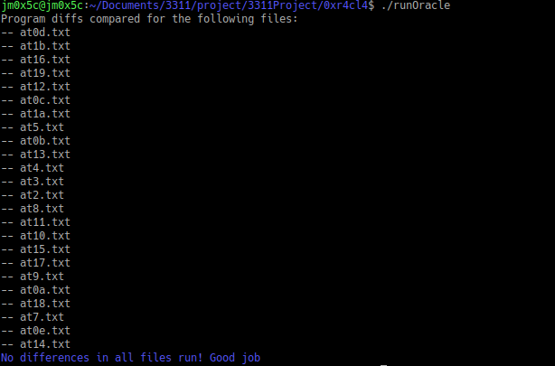
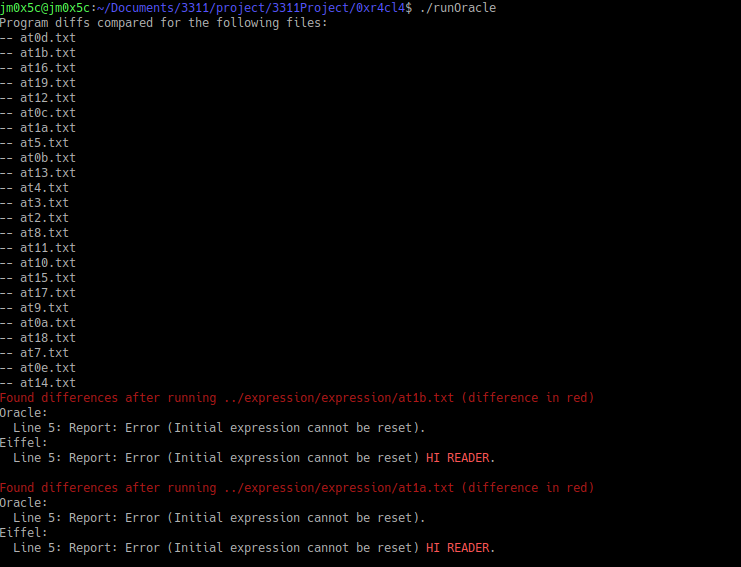

# 3311 Project Oracle Diff tool

This tool scans all files beginning with `at` and ending with `txt` to run through the correct implementation
given by Prof. Jackie Wang, along with your eiffel executable, and compares their differences.

It does not use any `atX.expected.txt` files. Rather, it runs them through the oracle and holds the differences in memory, which is a lot faster than saving onto
a temporary location and reading off disk.

The diff tool is tolerant of leading and trailing whitespace, but not of inter-word whitespace. I could change this,
but why on earth would you have different spaces between words when you can literally copy the error message from the lab spec!!!

## Required:

* GHC 8.0+
* Cabal 2.2+
* Mac or Linux, since it has a dependency on `System.FilePath.Posix` and I dislike windows anyway.

### Usage
`chmod +x difftool` so you can run it.

Start by running `cabal new-build` to see the build status. Alternatively, don't bother since running `./difftool` will compile it anyway, but you can see the compilation output this way.
If you can be patient and not despair, subsequent runs after the first compile will be blazing fast. The first run will be slow at first, as it compiles.

After it is compiled, it should run fast. Example:

```
jm0x5c@jm0x5c:~/Documents/3311/project/3311Project/0xr4cl4$ time ./runOracle 1> /dev/null 

real    0m0.314s
user    0m1.130s
sys     0m0.298s
```

Run by setting:
* `--eiffel-path` to the path of your eiffel executable (the file itself. Typically the location inside EIFGENs).
*`--oracle-path` to the path of the oracle provided by the professor (just `oracle` is fine, since I am also including it here)
* `--at-file-dir` to the path of where your `atX.txt` files are.

Note: It's easier to just make a new bash script that references `./difftool` to not have to set the arguments every time. See `runOracle` for an example.

If you are on mac or a unix system with cabal on it, and want to run it without the alias, `cabal -v0 new-run -- <args>` is how to do it
(see `difftool` file)

Example output that is successful:



Example output with errors:


